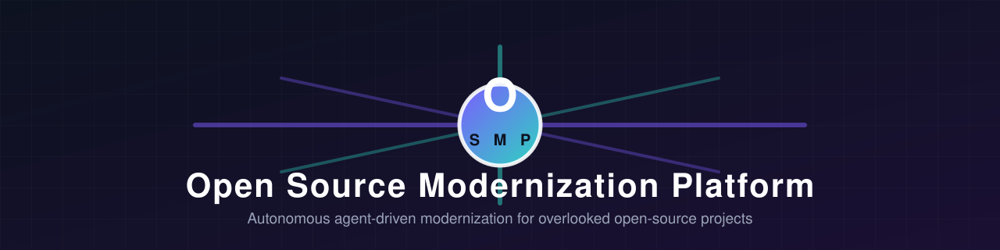
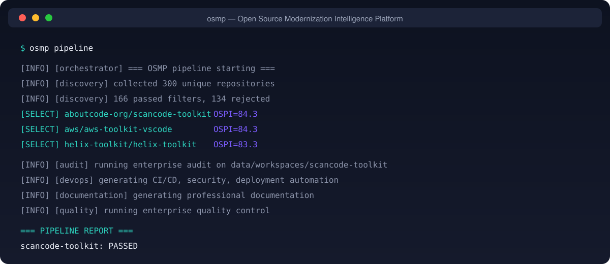
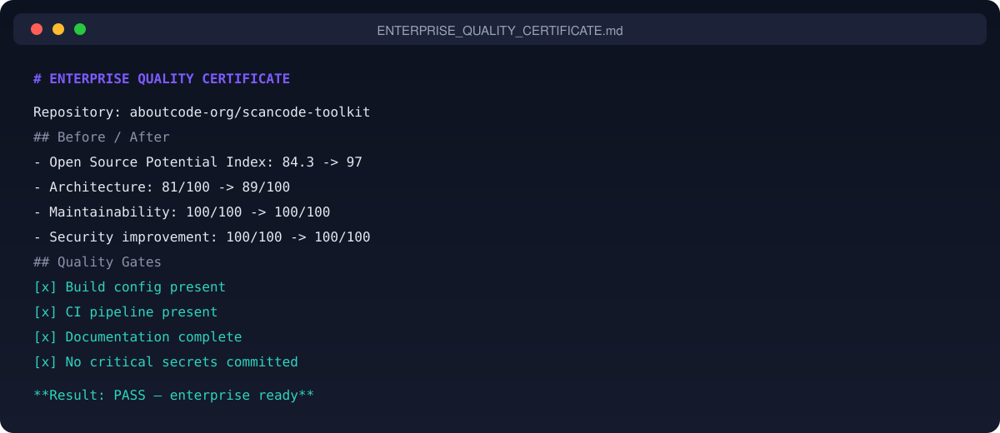

<p align="center">
  
</p>

<h1 align="center">OSMP — Open Source Modernization Platform</h1>

<p align="center">
  <em>An autonomous engineering organization that discovers overlooked open-source projects,
  modernizes them to enterprise standards, and gives the improvements back to the community.</em>
</p>

<p align="center">
  <a href="https://github.com/Nortaq-PlayNexus/osmp/actions"></a>
  <a href="https://www.npmjs.com/package/osmp"></a>
  <a href="LICENSE"></a>
  <a href="https://nodejs.org"></a>
  
  <a href="https://conventionalcommits.org"></a>
</p>

<p align="center">
  <a href="#features">Features</a> ·
  <a href="#screenshots">Screenshots</a> ·
  <a href="#getting-started">Getting Started</a> ·
  <a href="#the-14-phase-pipeline">Pipeline</a> ·
  <a href="docs/architecture.md">Architecture</a> ·
  <a href="docs/roadmap.md">Roadmap</a> ·
  <a href="#contributing">Contributing</a>
</p>

---

## Why OSMP?

Most open-source software is genuinely useful yet chronically underappreciated: small teams,
unmaintained dependency chains, no CI, sparse documentation. These projects deserve better than
neglect — but few maintainers have the time to harden, document, and productionize their work.

**OSMP** is a multi-agent engineering organization that fills that gap. It finds high-potential
repositories, understands them like a senior team would, modernizes them with discipline, and
returns the improvements through professional upstream pull requests — always preserving the
original author's vision, license, and identity.

## Technology

| Component | Stack |
|-----------|-------|
| Runtime | Node.js ≥ 22.6 (native TypeScript) |
| Language | TypeScript (strict, no transpile step) |
| Testing | `node:test` + `node:assert` |
| Linting | ESLint |
| Formatting | Prettier |
| CI | GitHub Actions |
| Dependencies | Zero runtime dependencies |

## Features

- **14-phase autonomous pipeline** — from global discovery to upstream contribution, driven by
  specialized AI agents (CTO, architect, security engineer, QA, docs, community manager, and more).
- **Open Source Potential Index (OSPI)** — a weighted, evidence-based scoring model
  (`Architecture × 20% + Innovation × 20% + Modernization × 20% + Community × 15% +
  Enterprise × 15% + Activity × 10%`) that only accepts candidates scoring ≥ 80.
- **Principled discovery** — automatically rejects unlicensed, abandoned, archived, tutorial,
  fork, and AI-spam repositories.
- **Full branch topology** — `main-original`, `backup/pre-modernization`,
  `feature/enterprise-modernization`, `security/hardening`, `performance/optimization` created on
  acquisition, so the original code is never at risk.
- **Deep audit** — filesystem analysis, secret detection, package-manager detection, and optional
  Semgrep / Trivy / gitleaks integration.
- **Enterprise hardening** — CI/CD, Docker, security workflows, structured errors, validation,
  accessibility and design-system guidelines, and a full testing strategy.
- **Enterprise Quality Certificate** — an automated before/after quality gate report for every
  repository.
- **Durable project memory** — every decision, phase result, audit, and community interaction is
  persisted and reloadable across runs.
- **Zero runtime dependencies** — runs on stock Node.js ≥ 22.6 with native TypeScript support.
  No transpile step, no install step beyond `npm ci` for development tooling.
- **Open-source ethics by design** — preserves licenses and attribution, prefers additive
  upstream-friendly changes over rewrites, and never generates a license on a project's behalf.

## Screenshots

| Discovery pipeline | Enterprise quality certificate |
|:---:|:---:|
|  |  |

## Getting Started

### Requirements

- **Node.js ≥ 22.6** (native TypeScript support; no build step required)
- **git** for repository acquisition
- A **GitHub personal access token** (classic, `repo` scope) for authenticated discovery,
  forking, and PR operations. Optional but strongly recommended — unauthenticated use is limited
  to ~60 requests/hour.

### Installation

```bash
# Clone the repository
git clone https://github.com/Nortaq-PlayNexus/osmp.git
cd osmp

# Install development tooling (typecheck, lint, test runners)
npm ci

# Configure
copy .env.example .env
#   GITHUB_TOKEN=ghp_...
#   GITHUB_OWNER=yourusername
```

### Quick start

```bash
# Phase 1 only — discover and score candidate repositories
npm run discover

# Full 14-phase pipeline (DRY_RUN=true by default — safe, no writes to GitHub)
npm run pipeline

# List projects tracked in project memory
npm run list
```

> **Safety first:** the default configuration runs in **dry-run mode**. It simulates the entire
> pipeline locally, writes artifacts into `data/`, and never forks, clones, or pushes to GitHub.
> Set `DRY_RUN=false` in `.env` only when you are ready for live acquisition and contributions.

### Development commands

```bash
npm run verify          # typecheck + lint + tests (run before every push)
npm run typecheck       # strict TypeScript check
npm run lint            # ESLint
npm run lint:fix        # ESLint with autofix
npm run format          # Prettier
npm test                # unit + integration tests
npm run test:coverage   # tests with coverage report
```

## The 14-Phase Pipeline

| # | Phase | Agent |
|---|-------|-------|
| 1 | Global Repository Discovery | Repository Intelligence Analyst |
| 2 | Autonomous Repository Acquisition | Repository Intelligence Analyst |
| 3 | Deep Autonomous Software Audit | Security Research Engineer |
| 4 | Autonomous Modernization Engine | Principal Software Architect |
| 5 | Next-Generation UX Engine | Frontend Experience Engineer |
| 6 | Backend Enterprise Transformation | Backend Architect |
| 7 | Intelligent AI Feature Analysis | AI Product Engineer |
| 8 | Autonomous Testing Lab | QA Automation Engineer |
| 9 | DevOps Automation System | DevOps/SRE Engineer |
| 10 | Documentation AI System | Technical Documentation Engineer |
| 11 | Autonomous Quality Control | Code Review Maintainer |
| 12 | Professional Open Source Contribution | Open Source Community Manager |
| 13 | Community Intelligence Loop | Open Source Community Manager |
| 14 | Modernization Portfolio Generator | CTO |

## Outputs

Every processed repository produces:

- **Workspace** (`data/workspaces/<repo>/`) — `MODERNIZATION_BLUEPRINT.md`,
  `ENTERPRISE_QUALITY_CERTIFICATE.md`, README, `docs/`, CI/CD workflows, Docker assets, tests,
  and hardening artifacts.
- **Project memory** (`data/memory/projects/<repo>.json`) — the durable record of state,
  decisions, phase results, audit output, and community feedback.
- **Portfolio** (`data/portfolio/PORTFOLIO.md`) — an aggregate enterprise report across all
  modernized repositories.

## Configuration Reference

All configuration lives in `.env` (see [docs/configuration.md](docs/configuration.md) for the
full reference):

| Variable | Default | Description |
|---|---|---|
| `GITHUB_TOKEN` | *(empty)* | GitHub personal access token |
| `GITHUB_OWNER` | *(empty)* | GitHub username for forking |
| `WORKSPACE_ROOT` | `./data/workspaces` | Workspace directory |
| `MEMORY_DIR` | `./data/memory` | Project memory directory |
| `PORTFOLIO_DIR` | `./data/portfolio` | Portfolio output directory |
| `TOP_REPOSITORIES` | `5` | Max repositories selected per run |
| `MIN_STARS` / `MAX_STARS` | `50` / `5000` | Star-range filter for discovery |
| `SCORE_THRESHOLD` | `80` | Minimum OSPI to qualify |
| `SEARCH_QUERIES` | `10` | Number of discovery queries |
| `DRY_RUN` | `true` | When true, no writes to GitHub |

## Open-Source Ethics

OSMP operates under a strict ethical charter:

- **Respect original developers** — the original code is preserved on its own branches and
  never rewritten for its own sake.
- **Preserve licenses** — OSMP never re-licenses or strips license files; missing licenses are
  flagged for human decision, never auto-generated.
- **Maintain attribution** — all upstream history and authorship is retained.
- **Additive over destructive** — improvements favor clean, upstream-friendly additions over
  rewrites.
- **Protect project identity** — modernization serves the project's purpose; it never replaces it.

## Contributing

OSMP is itself open source and welcomes contributors. See:

- [Contributing Guide](CONTRIBUTING.md)
- [Code of Conduct](CODE_OF_CONDUCT.md)
- [Security Policy](SECURITY.md)
- [Changelog](CHANGELOG.md)
- [Roadmap](docs/roadmap.md)

## License

[MIT](LICENSE) © OSMP contributors
